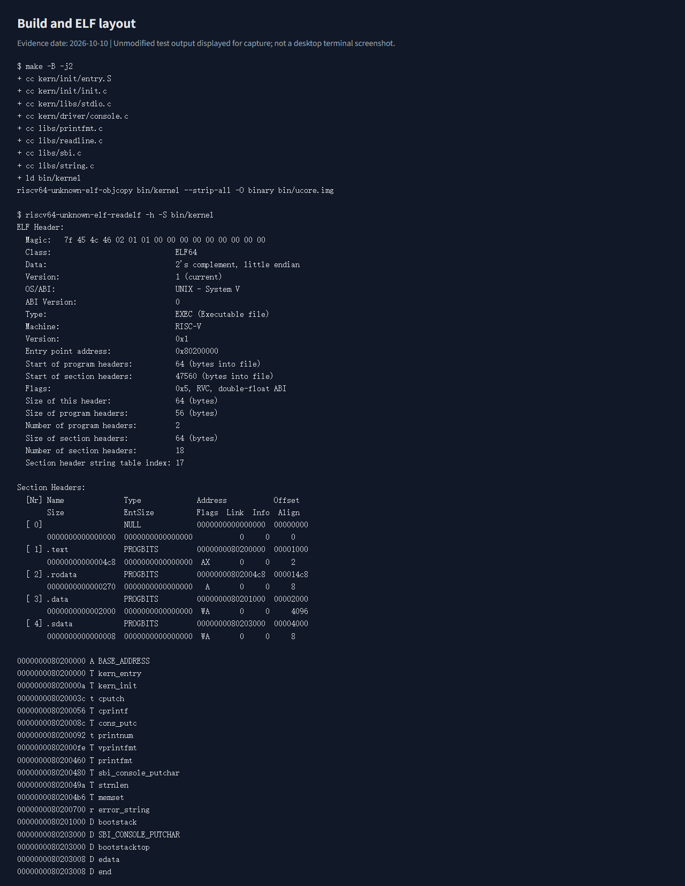
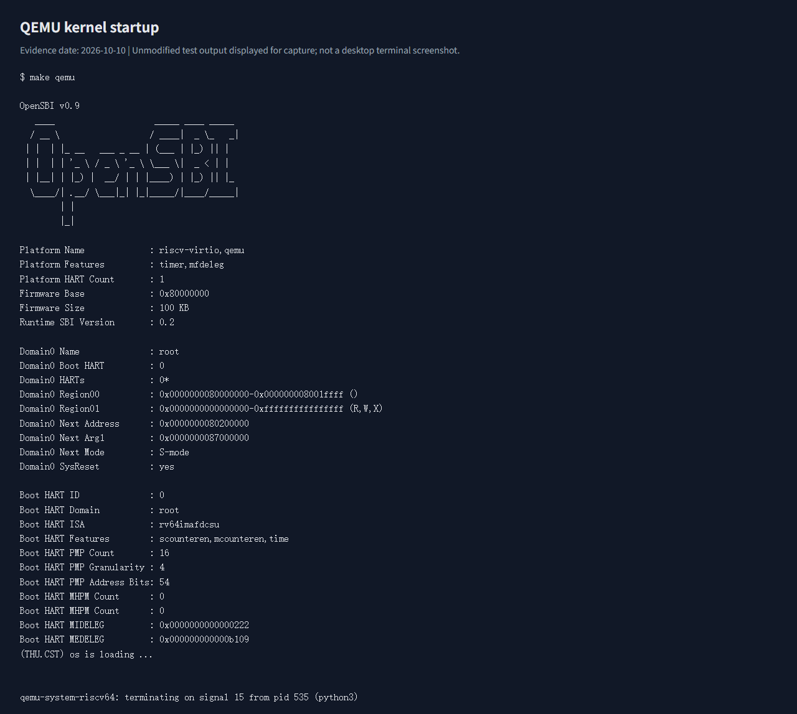
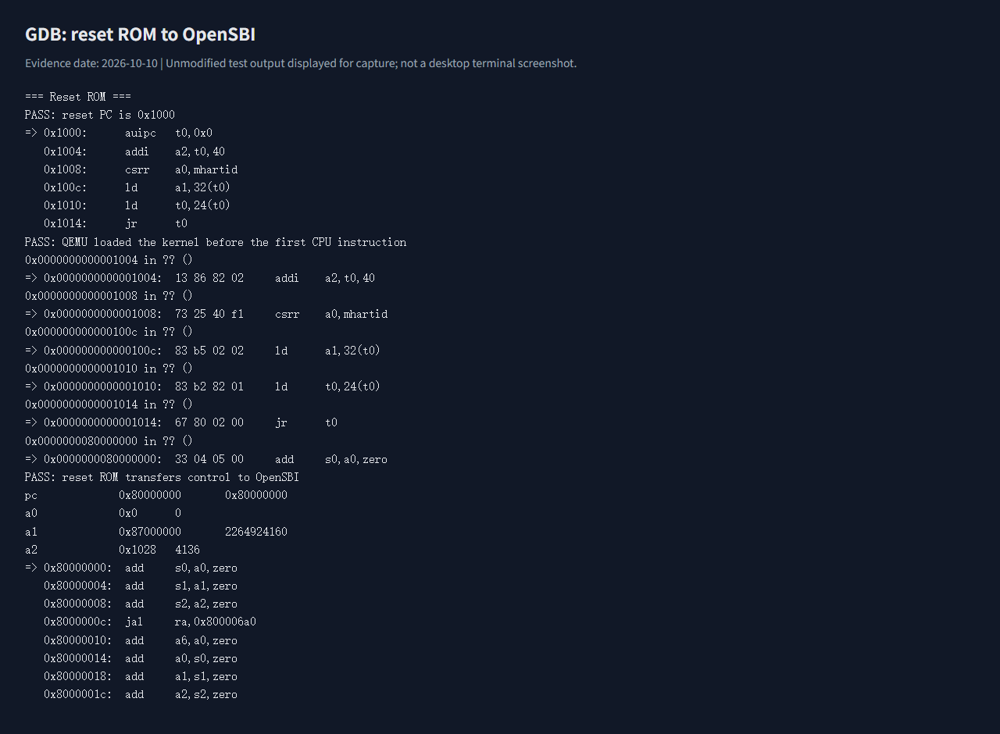
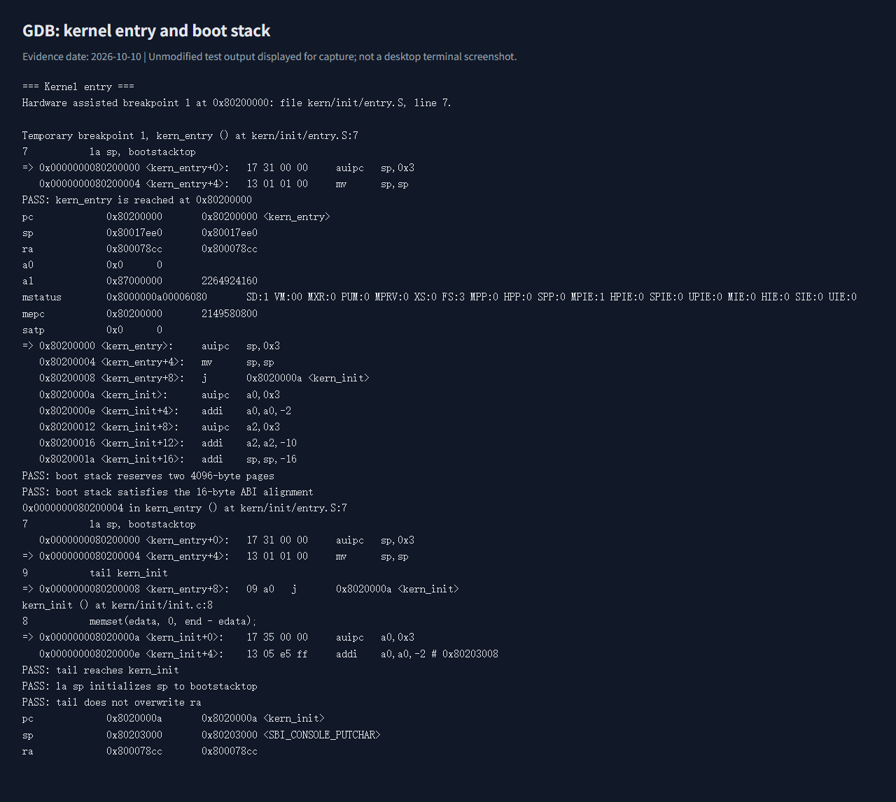
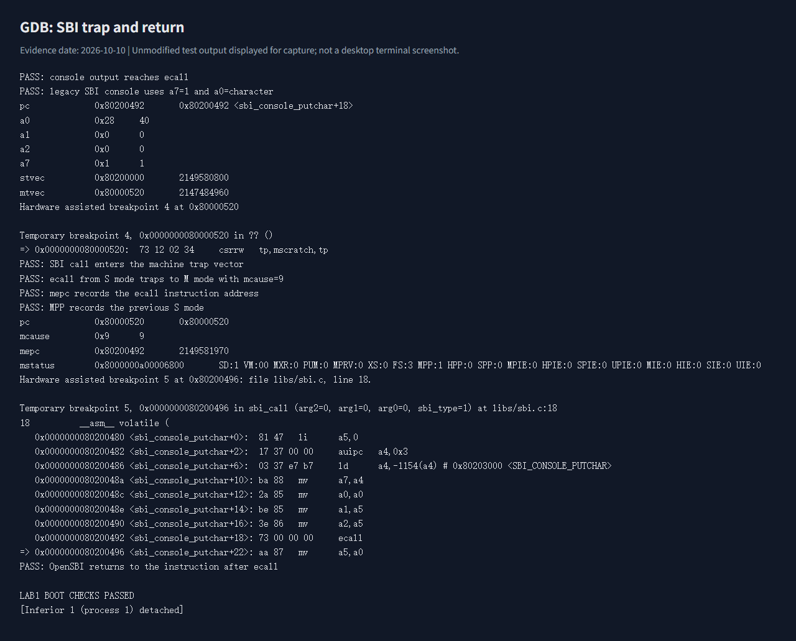
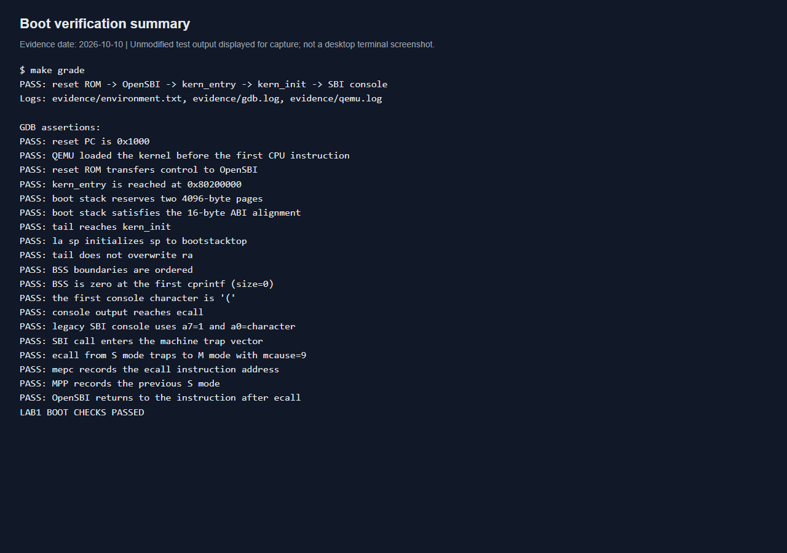
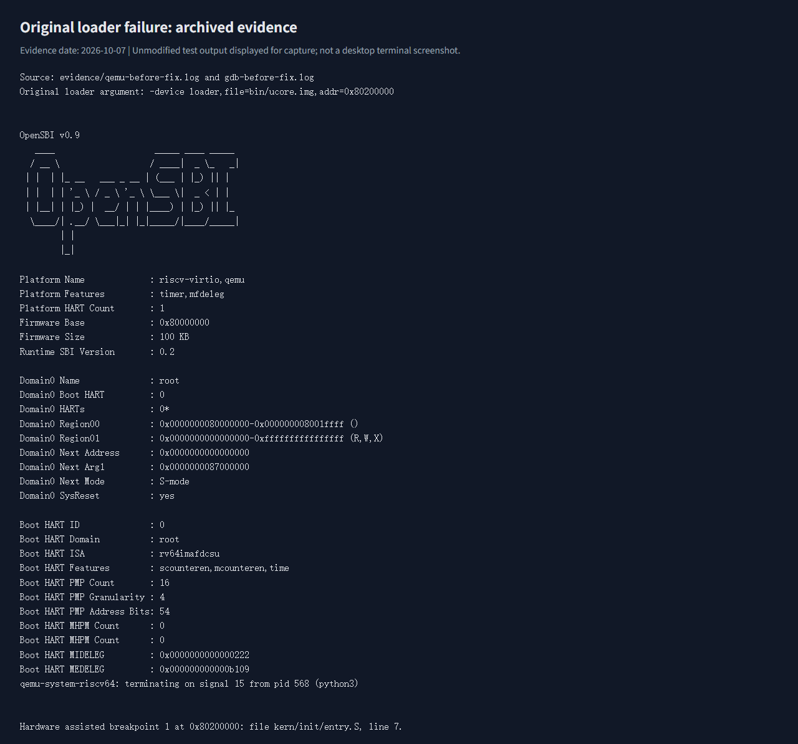

# 操作系统实验报告

## 实验基本信息

| 项目 | 内容 |
| --- | --- |
| 实验名称 | Lab1：最小可执行内核与启动流程 |
| 小组 | NKU2026OS_NO.30 |
| 小组成员 | 2412267—高家铭、2414067—窦思微、2411520—谢国辉 |
| 首次实验完成日期 | 2026-10-07 |
| 交付完成与重新验证日期 | 2026-10-10 |
| 提交仓库 | [NKU2026OS_NO.30](https://github.com/kighter123456/NKU2026OS_NO.30/tree/lab1) |
| 实验分支 | `lab1` |

### 小组分工

根据小组授权，按实验任务安排以下职责；这份安排不从 AI 自动执行记录推定个人的历史贡献。

| 成员 | 负责的练习/模块 | 报告分工 |
| --- | --- | --- |
| 2412267—高家铭 | Lab0 环境、编译链接、启动兼容性检查；练习 2 启动跟踪 | 实验环境、整体启动逻辑和迭代分析 |
| 2414067—窦思微 | 练习 1 入口汇编、栈和尾调用；核心输出模块分析 | 练习 1 解答、核心函数及 OS 原理对照 |
| 2411520—谢国辉 | 验证结果与截图核对、提示词汇总和交付目录检查 | 测试与验证、AI 协作记录及报告整合 |

本报告按上传的《实验报告模板.md》组织：基本信息、实验目的、环境、整体逻辑、实现及练习、测试、总结。交付分为 `code/` 和 `report/`；提示词见 [prompt.md](prompt.md)，截图位于 `report/images/`。本地指导书及压缩包继续排除上传。

## 一、实验目的

1. 建立 RISC-V 交叉编译与 QEMU 模拟环境，理解 ELF、原始镜像和链接脚本在内核启动中的作用。
2. 理解汇编入口、启动栈和 C 初始化之间的关系，解释 `la sp, bootstacktop` 与 `tail kern_init`。
3. 使用 GDB 观察 CPU 从复位到 OpenSBI 再到内核入口的过程，记录真实指令与寄存器值。
4. 理解格式化输出与 SBI 的分层接口，验证 S 模式 `ecall` 陷入 M 模式并返回的过程。
5. 使用 AI 辅助读取代码、配置环境、分析失败原因，并以编译、调试和实际输出检验结果。

## 二、实验环境

### AI 工具与使用范围

| 使用范围 | AI 编程工具 | 底层模型 | 备注 |
| --- | --- | --- | --- |
| 本次小组实验会话 | Codex 桌面应用 | GPT-6 | 访问本地工作区，辅助执行 WSL 编译与调试，修改文档并操作 Git |

本表仅记录本会话能确认的统一工具环境，没有证据表明各成员另行使用了其他工具或模型。提示词汇总记录实际用户请求，不把自动工具调用冒充用户输入。

宿主机为 Windows，使用已有 Ubuntu WSL2 作为 Linux 开发环境。仓库根目录对应 `/mnt/e/桌面/OSLab/lab1`，实验源码位于 `code/`，即 `/mnt/e/桌面/OSLab/lab1/code`。本文的源码路径相对于 `code/`，图片路径相对于 `report/`。交叉编译器在 x86_64 上执行，生成 RV64 机器码；QEMU 模拟 RISC-V CPU、内存、串口及固件。

| 工具 | 实际版本 | 用途 |
| --- | --- | --- |
| Ubuntu | 22.04.1 LTS，WSL2 | Linux 编译与调试环境 |
| GNU Make | 4.3 | 管理编译、链接和运行规则 |
| RISC-V GCC | 10.2.0 | 编译 C 与汇编 |
| RISC-V binutils | 2.35.1 | 链接、反汇编及镜像转换 |
| QEMU | 6.2.0 | 模拟 `virt` 机器 |
| GDB multiarch | 12.1 | 读取 RV64 指令及远程调试 |
| OpenSBI | 0.9，运行时 SBI 0.2 | 初始化机器态环境并提供 SBI 服务 |

安装软件包 `gcc-riscv64-unknown-elf`、`binutils-riscv64-unknown-elf`、`qemu-system-misc` 和 `gdb-multiarch`，沿用已有 Make 与 Python。发行版软件包安装后即可通过 `/usr/bin` 使用，无需额外修改 `.bashrc`。指导书关于 apt 中 QEMU 版本过低的说明针对旧环境，本机 6.2 已达到最低版本要求。

已实际检查 Linux 目录与源码、工具路径、版本和编译结果。完整版本输出见 [environment.txt](../code/evidence/environment.txt)。源码通过 `make -B -j2` 全量编译，记录见 [build.log](../code/evidence/build.log)。

## 三、实验整体逻辑分析

本章围绕“没有现成操作系统时，怎样运行第一个内核程序并输出信息”逐步展开：先建立交叉编译环境，理解 ELF 与原始镜像及内存段，再用链接脚本确定入口和布局，准备汇编入口与内核栈，进入 C 初始化函数，最后通过 SBI 服务完成格式化输出，并用 GDB 验证各阶段。

我对这条逻辑线的理解是，每一步都在满足下一步的运行前提。交叉编译解决“指令能否被目标 CPU 执行”，链接和加载解决“代码是否出现在它预期的地址”，汇编入口解决“C 函数是否具备可用的栈”，BSS 初始化解决“全局数据是否满足 C 语言的初始值约定”，SBI 输出则提供第一个可观察的运行结果。仅有一个编译成功的文件，并不能证明上述条件全部成立，因此最后需要通过断点、寄存器与实际输出验证。

这一章建立的是后续内核功能的运行基础。内存管理、进程调度等机制都要从一个已经能够进入 C 代码并提供调试输出的内核开始，但本章的无限循环还没有承担这些管理任务。

编译流程为：

```text
C / 汇编源码 -> RISC-V .o -> 按 kernel.ld 链接为 bin/kernel
             -> objcopy 转换为 bin/ucore.img -> QEMU 加载与执行
```

实际启动流程为：

```text
QEMU 预先加载 OpenSBI、内核镜像和设备树
CPU 复位到 0x1000（MROM）
  -> 0x80000000（OpenSBI，M 模式）
  -> 0x80200000（kern_entry，S 模式）
  -> 设置 sp -> kern_init -> 清零 BSS -> cprintf
  -> SBI ecall -> OpenSBI 串口输出 -> 返回 S 模式
  -> 内核无限循环
```

这里必须区分“加载”和“交接控制权”。本实验中 QEMU 在 CPU 执行第一条指令之前已将内核载入内存，OpenSBI 负责初始化及随后交接。启动时并不存在 OpenSBI 从磁盘读取本实验镜像的步骤，也没有模拟内核磁盘。

## 四、实验内容与实现

### 实现范围

环境与启动流程负责人：2412267—高家铭。核心模块分析负责人：2414067—窦思微。基础环境已提供最小内核入口、链接脚本和输出库；本次工作是配置环境、修复启动参数兼容性、补充验证工具并完成练习分析，没有为了叙述“实现”而声称重写已有内核功能。本指导书 Lab1 只有以下两个练习，没有额外 Challenge。

### 实际最终提示词

环境、启动验证和两个练习均源自同一个实际请求：

```text
根据book中的指导从lab0开始完成lab1，文件夹中的文件石基础环境
```

这是 `prompt.md` 中的 P01。会话没有另行输入过逐函数提示词，后续是依据工具输出继续调试；不把事后整理的规格冒充当时的最终提示词。报告完善与交付组织的实际追加要求也全部记录在 [prompt.md](prompt.md)。

### 练习 1：理解内核启动中的程序入口操作

负责人：2414067—窦思微。本练习涉及汇编符号 `kern_entry`、`bootstack`、`bootstacktop`，以及 C 入口：

```c
int kern_init(void) __attribute__((noreturn));
```

**1. `la sp, bootstacktop` 的操作和目的**

`la` 是加载符号地址的汇编伪指令，将 `bootstacktop` 的地址写入栈指针寄存器 `sp`，不是读取该地址中的数据。启动栈由 `entry.S` 的 `.space KSTACKSIZE` 预留，`KSTACKSIZE = 2 * 4096 = 8192` 字节，底部按 4096 字节对齐。

栈从高地址向低地址增长，所以空栈的初始 `sp` 指向预留区域的高端。C 函数的局部变量、保存的寄存器、返回地址及调用帧需要有效栈空间；不能沿用 OpenSBI 的私有栈。

本次符号和单步结果：

```text
bootstack    = 0x80201000
bootstacktop = 0x80203000
进入 kern_entry 时：sp = 0x80017ee0（固件使用的栈）
执行 la 后：         sp = 0x80203000（内核启动栈）
```

实际展开为：

```asm
0x80200000: auipc sp,0x3
0x80200004: addi  sp,sp,0    # GDB 显示为 mv sp,sp
```

`auipc` 使用该指令所在地址加上 `0x3000`，本次低位偏移为 0，因此得到 `0x80203000`。两条指令属于同一条源码伪指令。栈顶满足 RISC-V ABI 要求的 16 字节对齐。`bootstacktop` 是边界标签，不占用字节，所以它与后续 `SBI_CONSOLE_PUTCHAR` 数据符号地址相同是正常的。

**2. `tail kern_init` 的操作和目的**

`tail` 是尾调用伪指令，将控制权交给 `kern_init`，不设置新的返回地址 `ra`。通常可以展开为 PC 相对地址计算和 `jalr x0,...`；本次链接器进行了松弛优化，最终变为一条 16 位压缩跳转，反汇编显示为：

```asm
0x80200008: j 0x8020000a
```

其目的在于结束汇编入口阶段，进入 C 语言内核初始化。`kern_init` 声明为 `noreturn` 并最终无限循环，因此无需返回入口汇编，也无需额外建立返回链。

实际观察到跳转前后 `ra` 均为 `0x800078cc`，进入 `kern_init` 的第一条指令时 `sp` 仍为 `0x80203000`。随后 C 函数自身的序言才会继续调整栈指针。不能把 `tail` 理解成必然清零 `ra`；它保留寄存器中的旧值。

### 练习 2：使用 GDB 验证启动流程

负责人：2412267—高家铭，2411520—谢国辉负责测试记录核对。本练习需实际记录复位指令地址、其功能及到达内核第一条指令的调试过程。验证工具为 `tools/boot.gdb` 和 `tools/verify.py`，在宿主环境中执行，不是内核自身函数。

**1. 调试方法**

在项目目录使用两个 Ubuntu 终端，先执行 `make debug`，再执行 `make gdb`。QEMU 的 `-S` 让 CPU 在复位位置暂停，`-s` 在端口 1234 提供 GDB 服务。GDB 加载的是带调试符号的 `bin/kernel`，QEMU 加载的是原始镜像 `bin/ucore.img`。

主要命令如下；也可执行 `make grade` 自动复现断点、单步和寄存器检查，完整输出见 [gdb.log](../code/evidence/gdb.log)。

```gdb
x/6i 0x1000
si 6
info registers pc a0 a1 a2
b *0x80200000
continue
x/8i $pc
si 3
info registers pc sp ra
```

**2. 加电后最初的指令及功能**

在本次 QEMU `virt` 模型中，连接后 `pc = 0x1000`。此处是 QEMU 构造的 MROM 复位跳板，尚未进入位于 DRAM 的 OpenSBI 主体。

| 地址 | 实际指令 | 功能 |
| --- | --- | --- |
| `0x1000` | `auipc t0,0x0` | 取当前地址，令 `t0 = 0x1000` |
| `0x1004` | `addi a2,t0,40` | 令 `a2 = 0x1028`，传递固件动态信息结构地址 |
| `0x1008` | `csrr a0,mhartid` | 读取当前硬件线程 ID，本次为 0 |
| `0x100c` | `ld a1,32(t0)` | 从 `0x1020` 取设备树地址，本次为 `0x87000000` |
| `0x1010` | `ld t0,24(t0)` | 从 `0x1018` 取 OpenSBI 入口 `0x80000000` |
| `0x1014` | `jr t0` | 跳转到 OpenSBI |

所以最初几条指令主要准备固件参数并跳转，完整的硬件初始化由后面的 OpenSBI 完成；`0x1000` 处的跳板和 `0x80000000` 处的固件应分别理解。地址是本次模拟平台的配置，不代表所有 RISC-V 硬件统一使用该复位地址。

**3. 从 OpenSBI 到内核第一条指令**

单步执行六条复位指令后，观测值为：

```text
pc = 0x80000000
a0 = 0
a1 = 0x87000000
a2 = 0x1028
```

随后在 `0x80200000` 设置断点并继续，避免单步执行大量固件代码。OpenSBI 输出：

```text
Domain0 Next Address : 0x0000000080200000
Domain0 Next Mode    : S-mode
```

断点命中 `kern_entry`，此时 `pc = mepc = 0x80200000`，`satp = 0`。说明控制权交给内核时尚未启用分页；单步三条机器指令后到达 `kern_init = 0x8020000a`。这完成了练习所要求的复位到内核入口跟踪。

**4. 对内核加载时机的验证**

自动脚本在 `pc = 0x1000`、CPU 尚未执行指令时，读取内存 `0x80200000` 的前 16 字节，与 `bin/ucore.img` 的前 16 字节进行比较，结果一致。

因此指导书建议的 `watch *0x80200000` 在当前加载方式下不会观察到固件加载瞬间，因为加载发生在连接 GDB 之前。观察交接时应使用入口断点；若调试其他具有运行时搬运步骤的固件，写观察点才可能观察到搬运行为。

**5. 进一步验证 SBI 输出**

沿 `cprintf -> sbi_console_putchar` 设置断点，在第一字符 `(` 的输出处记录：

```text
ecall 前：pc=0x80200492，a7=1，a0=0x28
机器态入口：pc=mtvec=0x80000520
mcause=9，mepc=0x80200492，mstatus.MPP=1
返回后：pc=0x80200496
```

`mcause=9` 对应 S 模式环境调用；`MPP=1` 记录陷入前的 S 模式。OpenSBI 处理字符后返回 `ecall` 后一条指令，控制台最终输出 `(THU.CST) os is loading ...`。实际 QEMU 输出见 [qemu.log](../code/evidence/qemu.log)。

### 核心函数与功能模块

本章所分析的主要 C 接口为：

```c
int kern_init(void) __attribute__((noreturn));
void *memset(void *s, char c, size_t n);
int cprintf(const char *fmt, ...);
int vcprintf(const char *fmt, va_list ap);
void vprintfmt(void (*putch)(int, void *), void *putdat,
              const char *fmt, va_list ap);
void cons_putc(int c);
void sbi_console_putchar(unsigned char ch);
uint64_t sbi_call(uint64_t sbi_type, uint64_t arg0,
                  uint64_t arg1, uint64_t arg2);
```

这些接口签名用于理解实际调用链；新增的验证工具和 Makefile 修改不改变这些内核接口。

| 模块 | 作用及关键约束 |
| --- | --- |
| `tools/kernel.ld` | 指定 RISC-V 架构、`kern_entry` 入口和 `0x80200000` 基址；排列代码、只读数据、数据与 BSS |
| `kern/init/entry.S` | 静态预留启动栈，设置 `sp`，以尾调用进入 C |
| `kern/init/init.c::kern_init` | `memset(edata,0,end-edata)` 清理零初始化区，打印信息，进入无限循环 |
| `libs/string.c::memset` | 按字节设置内存；内核使用自有实现，不依赖宿主系统 glibc |
| `kern/libs/stdio.c::cprintf` | 建立可变参数列表，调用 `vcprintf` 并返回打印字符数 |
| `libs/printfmt.c::vprintfmt` | 解析格式字符串，经回调输出字符 |
| `kern/driver/console.c::cons_putc` | 转交字符到 SBI 控制台接口 |
| `libs/sbi.c::sbi_call` | 按旧版 SBI 调用约定传递功能号、参数，并执行 `ecall` |
| `Makefile`、`tools/function.mk` | 管理依赖、编译链接、镜像生成及运行调试 |

`ALIGN(0x1000)` 的含义是对齐到 4096 字节边界。原始二进制镜像没有 ELF 头和调试符号，加载地址由 QEMU 参数决定。通常 `objcopy -O binary` 不将 `NOBITS` 类型的 BSS 物化为文件中的零字节，内核需要自己清零。ELF 的程序头描述加载段，节头描述链接和调试相关的节，二者不能混为一谈。

本次 ELF 的 `.text` 从 `0x80200000` 开始，`.data` 从 `0x80201000` 开始，`.sdata` 从 `0x80203000` 开始，入口为 `0x80200000`。详见 [elf-layout.txt](../code/evidence/elf-layout.txt)及[symbols.txt](../code/evidence/symbols.txt)。

当前链接后的 `edata = end = 0x80203008`，BSS 长度为 0：没有保留下来的非零长度未初始化全局区域。因此脚本检查了边界及空区间，但本次不能据此声称验证了非空 BSS 的写入清零效果。启动栈位于 `.data`，是原始镜像中的真实字节。

**1. 编译、链接与加载模块**

`Makefile` 借助 `tools/function.mk` 收集源码、生成目标文件和头文件依赖，再调用链接器。`-nostdinc` 配合本项目的头文件目录，使内核使用自己的类型、字符串和输出接口；链接时的 `-nostdlib` 避免依赖宿主操作系统的运行时库。`-g` 保留调试信息，供 GDB 将地址对应到源码行。

`kernel.ld` 解决的是各段放在哪里以及入口是什么，QEMU 参数解决的是把生成的文件载入模拟机器并安排固件交接。`ENTRY(kern_entry)` 只设置 ELF 入口，并不会让原始二进制文件自动具有入口元数据；转换成 `ucore.img` 后，启动配置仍需与链接地址一致。实际 ELF 检查和内核入口断点共同验证了这种一致性。

**2. 汇编入口与 C 初始化模块**

`kern_entry` 的职责是准备进入 C 的最小运行条件。启动栈通过汇编静态预留，设置 `sp` 时没有调用动态内存分配器。`tail kern_init` 完成执行阶段的转换，两条伪指令的具体作用和实测展开已在练习 1 中说明。

`kern_init` 中的 `edata`、`end` 是链接器提供的地址符号，不是函数在运行时创建的数组。它们标记待清零区间的边界，`memset` 用这个区间的长度逐字节写零。之后打印启动信息，再进入无限循环。这个循环保证 `noreturn` 的约定，也反映当前内核还没有可执行的后续任务；它不是调度器，也不会自动让 CPU 休眠。

**3. 格式化输出与设备接口模块**

输出链路为 `cprintf -> vcprintf -> vprintfmt -> cputch -> cons_putc -> sbi_console_putchar -> sbi_call`。`cprintf` 负责建立和结束可变参数列表；`vcprintf` 初始化字符计数并把计数地址传给格式化函数；`vprintfmt` 解析 `%s` 等格式符，通过回调输出各个字符。`cputch` 一边转交字符，一边增加计数，最终由 `cprintf` 返回打印字符数。

这种分层把格式处理与字符输出分开：格式化函数不用知道具体串口地址，控制台接口也不用理解 `%s`。本实验通过 OpenSBI 输出字符，若以后更换底层设备实现，上层格式化逻辑仍可复用。`stdio.h` 的名字虽然与标准库相同，实际使用的是本项目的实现。

`sbi_call` 将旧版 SBI 功能号放入 `a7`、参数放入 `a0` 至 `a2`，执行 `ecall`，再从 `a0` 取返回值。`ecall` 触发异常，由机器态固件处理，不是普通的 C 函数跳转。对于字符输出，服务编号是 1，首个字符参数是 `0x28`；练习 2 的 SBI 输出验证部分的机器态入口及返回断点验证了这条链路。这里验证的是所用工具链下的当前输出路径，不意味着其他 SBI 服务也已全部实现或验证。

**4. 调试与验证模块**

GDB 根据 `bin/kernel` 提供的符号理解代码，通过 QEMU 的远程调试接口控制模拟 CPU。它不在客体内核中运行，因此即使内核尚未建立控制台或异常处理，也能观察复位地址和寄存器。

`tools/boot.gdb` 将两个练习的关键观察转成断点、单步和断言，`tools/verify.py` 负责启动模拟器与调试器、检查启动字符串、保存日志及结束进程。它们是开发环境中的验证工具，不是内核启动时执行的组成部分。日志为报告提供依据，但对于 BSS 长度为 0 等条件，仍需明确检查本身能证明的范围。

### 实现迭代过程

核心启动兼容性问题经历两种配置：先验证基础 loader 参数失败，再改用 `-kernel` 验证成功。首次失败和修复后输出都有原始日志；这是同一用户请求下的验证迭代，没有额外用户提示词。

**1. 新版 OpenSBI 的入口地址**

原 Makefile 使用 `-device loader,file=bin/ucore.img,addr=0x80200000`。在当前 QEMU 6.2/OpenSBI 0.9 组合下，它加载了内核字节，却没有设置 OpenSBI 动态信息中的下一阶段地址，固件打印 `Domain0 Next Address : 0x0000000000000000`。GDB 能单步进入 OpenSBI，但无法命中内核入口，自动验证超时。

将 `qemu` 和 `debug` 目标改为 `-kernel bin/ucore.img` 后，QEMU 将 RV64 原始镜像载入 `0x80200000`，同时设置正确的下一阶段入口，成功启动。修复前的记录保存在 [qemu-before-fix.log](../code/evidence/qemu-before-fix.log)和[gdb-before-fix.log](../code/evidence/gdb-before-fix.log)，可与成功记录对照。

**2. 调试器与缺失的评分脚本**

发行版提供多架构 GDB，而非指导书工具链中的同名前缀 GDB。Makefile 增加自动选择，并让 `gdb` 目标先确保 ELF 已编译。

原始 Makefile 引用的 `tools/grade.sh` 在基础文件中不存在。本次新增 `tools/verify.py` 与 `tools/boot.gdb`，通过 `make grade` 执行启动验证，使用临时本机调试端口并在结束后回收 QEMU。现在 `grade` 也读取编译依赖，避免修改头文件后沿用过期目标文件。

这是针对本实验行为的自建检查，不等同于课程官方评分。未改动已有内核启动逻辑，也未增加后续实验的页表、时钟中断或进程管理。

验证脚本最初用单步观察 `ecall`，QEMU/GDB 的单步行为可能直接停在固件返回后的指令，因此补充 `mtvec` 入口和 `ecall+4` 返回地址断点，直接检查 `mcause`、`mepc`、`mstatus.MPP`。该改进是验证证据的补充，未修改内核 SBI 服务。当前目录改为 `code/` 后，于 2026-10-10 重新运行全量编译及启动检查。

## 五、测试与验证

### 测试方式与范围

在仓库根目录进入 `code/`，执行 `make -B -j2` 全量编译、`make grade` 启动验证及 `make qemu` 输出检查。2026-10-10 的原始输出保存在 `code/evidence/`，重验证结果均通过。QEMU 的无限循环由测试流程主动终止，日志中的终止消息不表示内核崩溃。

截图说明：下列 PNG 是浏览器对真实命令日志显示页面的截图，并非桌面终端窗口的原生截屏。测试输出没有改写；较长 GDB 日志按阶段截取显示，完整内容仍可通过原始日志核查。图 7 显示 2026-10-07 留存的修复前失败记录，其余六张显示 2026-10-10 重新验证结果。

| 测试 | 观察结果 | 对应截图 |
| --- | --- | --- |
| 全量编译与 ELF 布局 | 无编译错误，入口为 `0x80200000` | 图 1 |
| `make qemu` | 打印 `(THU.CST) os is loading ...` | 图 2 |
| 复位指令与 OpenSBI 入口 | `0x1000 -> 0x80000000` | 图 3 |
| 栈设置与尾调用 | 栈为 8192 字节，`sp=0x80203000`，`ra` 保留 | 图 4 |
| SBI 陷入与返回 | `mcause=9`，`MPP=1`，返回 `ecall+4` | 图 5 |
| `make grade` | 所有启动断言通过，打印 PASS 汇总 | 图 6 |
| 原始 loader 参数诊断 | 下一阶段入口为 0，无法命中内核入口 | 图 7 |

BSS 检查的实际区间长度为 0，只证明边界和空区间符合当前布局，不能据此声称验证过非空 BSS 清零。`make grade` 是自建启动验证，不是课程官方评分。

### 测试截图

图 1：编译、ELF 布局和符号。



图 2：`make qemu` 正常启动与输出。



图 3：GDB 观察复位 ROM 的六条指令并进入 OpenSBI。



图 4：GDB 命中内核入口、设置栈并跳转到 C 初始化。



图 5：SBI 服务的机器态入口和返回断点。



图 6：一次 `make grade` 的结果与同次 GDB 断言汇总。



图 7：修复前 loader 配置失败的留存日志。



### 证据与复现

下面按照证据、结论和执行路径组织记录，所有验证日志可通过项目中的脚本重新生成。

| Evidence | 原始来源 | 支持的 Finding | 复现方式 |
| --- | --- | --- | --- |
| E-001 | `evidence/build.log`、`evidence/elf-layout.txt` | F-001：生成 RV64 ELF，入口及布局正确 | `make -B -j2`；`riscv64-unknown-elf-readelf -h -S bin/kernel` |
| E-002 | `evidence/gdb.log` | F-002：从 MROM 经 OpenSBI 到 C 入口，栈和跳转符合预期 | `make grade` |
| E-003 | `evidence/qemu.log`、`evidence/run.log` | F-003：SBI 调用及控制台输出实际完成 | `make grade`；`make qemu` |
| E-004 | `evidence/qemu-before-fix.log` | F-004：旧参数在当前版本将下一阶段入口设为 0 | 成功日志对比旧日志；复现旧启动参数时需要限时停止 QEMU |

Path P-001：配置 Linux 工具（版本记录）-> 编译与检查布局（E-001/F-001）-> 复位单步、入口断点及栈检查（E-002/F-002）-> SBI 陷入和串口输出（E-003/F-003）。兼容性诊断 E-004/F-004 解释了启动参数调整的必要性。

最短复现命令，在 PowerShell 执行：

```powershell
wsl -d Ubuntu --cd "E:\桌面\OSLab\lab1\code" --exec make grade
```

## 六、实验总结与收获

### 对操作系统的理解

**1. 本实验涉及的知识点**

| 实验知识点 | OS 原理中的含义 | 联系与本实验的边界 |
| --- | --- | --- |
| 固件与内核启动 | 建立操作系统运行条件并移交控制权 | 使用预置 OpenSBI，没有自行编写完整 bootloader |
| M/S 特权级及 SBI | 特权分离、受控陷入与返回 | 内核向机器态固件请求服务；不同于用户程序向内核发起系统调用 |
| 栈与调用约定 | 保存执行上下文、支持函数调用 | 此处只有启动栈，还没有每进程内核栈与上下文切换 |
| 段布局及链接 | 将代码和数据放入预定地址 | 布局为物理地址，尚无分页、虚拟地址空间和权限隔离 |
| BSS 初始化 | 为零初始化的全局对象建立运行时语义 | 裸机入口主动调用 `memset`；普通用户程序常由加载器和运行时处理 |
| 控制台 I/O | 设备访问的抽象与分层 | 借助 SBI 完成字符输出，没有实现完整终端或串口驱动 |
| 可执行文件与加载 | 从文件布局转为可执行内存布局 | ELF 用于链接和调试，原始镜像由 QEMU 预加载 |
| 远程调试 | 观察指令、状态和异常以定位错误 | GDB 借助模拟器观察整个客体，不依赖内核已提供调试服务 |

**2. 重要但本实验没有对应实现的知识点**

内存管理是 OS 的基本职责。物理页分配器决定内存如何分配和回收，页表与 TLB 支持地址转换和访问权限，缺页处理与页面置换使系统能够管理超出即时可用物理内存的地址空间。本实验只有静态段布局和预留栈，`satp=0` 表明分页未启用，因此静态地址安排不能替代虚拟内存管理。

进程、线程和调度决定多个执行实体如何共享 CPU。它们需要进程控制块、状态转换、独立执行上下文、调度策略及上下文切换。本实验只运行一个内核初始化流程，没有就绪队列，也没有保存和恢复不同任务的寄存器；最后的无限循环不具备多任务能力。

中断与系统调用让内核能够响应外部事件和用户请求。时钟中断是抢占式调度的重要基础，用户态系统调用则为应用程序提供受权限约束的服务。本实验验证了 S 模式向 OpenSBI 的机器态调用，但尚未运行用户程序，也没有实现 U 模式到内核的系统调用处理。固件处理 SBI 异常不等于本内核已经建立了自己的完整异常和中断系统。

同步互斥与多核并发用于维护共享数据的一致性，涉及原子操作、锁、信号量以及死锁等问题。当前启动仅使用一个 hart，没有并发执行的内核任务，所以实验没有实际体现竞争条件和同步机制。

文件系统与持久化 I/O 负责命名、组织和长期保存数据，需要文件接口、存储设备驱动、元数据及缓存管理。本实验的 `ucore.img` 是由宿主机 QEMU 载入的文件，客体内核没有读取磁盘、打开文件或管理目录，镜像文件的存在不能说明内核具有文件系统。

保护与安全隔离依靠特权级、内存权限及资源访问检查来限制应用程序的行为。本实验已经观察到 M/S 模式分工，但没有用户地址空间、多进程隔离、用户指针检查或访问控制。特权级是保护机制的基础，完整隔离仍需要后续内核软件配合。

### AI 协作开发的经验

本次按 lab0.5 的“理解任务、梳理需求、生成与修改、编译测试、根据证据迭代”流程使用 AI。先检查指导书与真实源码，再运行编译和调试，依据失败日志修复 QEMU 参数，最后以成功日志编写报告。事实说明，编译通过只能验证语法和链接，不能证明固件会跳转到正确入口；必须补上运行观察。

版本差异也是协作中的实际问题：指导书中的 loader 参数在当前 QEMU/OpenSBI 组合下没有设置有效的下一阶段入口。解决问题依靠 `Domain0 Next Address` 和入口断点的证据，而不是仅复述教程步骤。同样，BSS 长度为 0 的检查必须说明局限，避免把测试脚本中的 PASS 解释成超出其范围的结论。

提示词需要说明目标和约束，源码与日志则帮助检验 AI 的判断。当前会话使用的是一个整体实验请求，实际用户追加要求记录在 [prompt.md](prompt.md)。AI 辅助完成代码分析、环境配置和报告整理，不替代小组对指令、特权转换及实验分工的理解与确认。

### 交付状态

本次交付采用 `lab1` 分支，两个目录分别是 `code/` 和 `report/`。实现源码、验证脚本与原始记录在 `code/`；本文为 `report/report.md`，提示词为 `report/prompt.md`，截图位于 `report/images/`。离线指导书、其压缩包和可重建的编译产物均排除上传。
